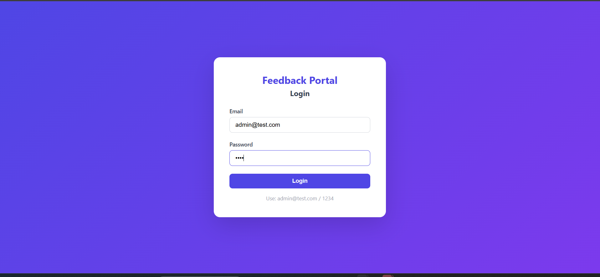
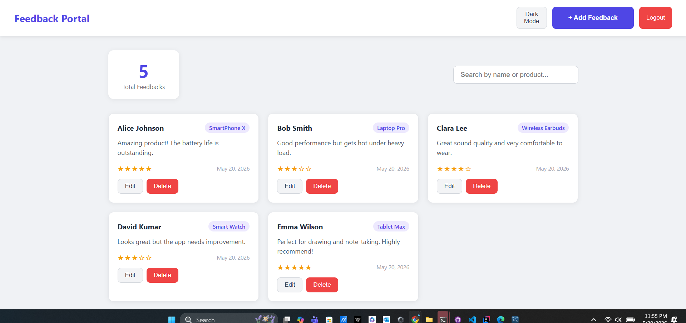
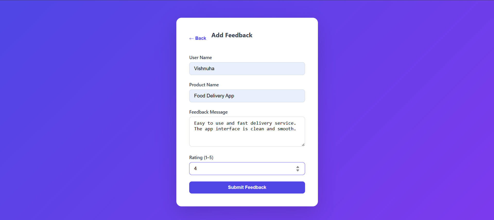
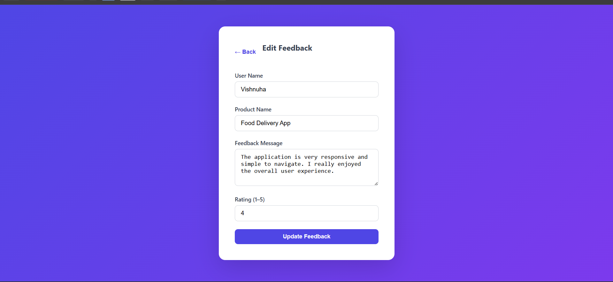

# Product Feedback Portal

A full-stack web application where users can submit, view, edit, and manage product feedback.

---

## Tech Stack

| Layer | Technology |
|-------|-----------|
| Frontend | React 18 + Vite + Axios |
| Backend | Java 24 + Spring Boot 3.4.1 |
| Database | MySQL 8 + Spring Data JPA |
| API | RESTful JSON API |

---

## Features

- Login page with hardcoded authentication
- Feedback dashboard with total count
- Add feedback form with validation
- Edit feedback
- Delete feedback
- Search feedbacks by name or product
- Dark mode toggle
- Responsive design (mobile friendly)
- Global error handling
- Bean validation on backend

---

## Project Structure

```
product-feedback-portal/
├── backend/                          # Spring Boot
│   ├── src/main/java/com/feedback/
│   │   ├── controller/
│   │   │   └── FeedbackController.java
│   │   ├── model/
│   │   │   └── Feedback.java
│   │   ├── repository/
│   │   │   └── FeedbackRepository.java
│   │   ├── service/
│   │   │   └── FeedbackService.java
│   │   ├── exception/
│   │   │   └── GlobalExceptionHandler.java
│   │   └── FeedbackApplication.java
│   ├── src/main/resources/
│   │   └── application.properties
│   └── pom.xml
│
├── frontend/                         # React
│   ├── src/
│   │   ├── pages/
│   │   │   ├── LoginPage.jsx
│   │   │   ├── Dashboard.jsx
│   │   │   ├── AddFeedback.jsx
│   │   │   └── EditFeedback.jsx
│   │   ├── components/
│   │   │   └── FeedbackCard.jsx
│   │   ├── api/
│   │   │   └── feedbackApi.js
│   │   └── App.jsx
│   └── package.json
│
├── database/
│   └── schema.sql
└── README.md
```

---

## Getting Started

### Prerequisites

- Java 24
- Maven
- Node.js 18+
- MySQL 8

### 1. Database Setup

Open MySQL and run:

```sql
CREATE DATABASE feedback_db;
```

Optional — insert sample data:

```sql
USE feedback_db;

INSERT INTO feedbacks (user_name, product_name, message, rating, created_at) VALUES
('Alice Johnson', 'SmartPhone X', 'Amazing product! Battery life is outstanding.', 5, NOW()),
('Bob Smith', 'Laptop Pro', 'Good performance but gets hot under heavy load.', 3, NOW()),
('Clara Lee', 'Wireless Earbuds', 'Great sound quality and very comfortable.', 4, NOW());
```

### 2. Backend Setup

Open `backend/src/main/resources/application.properties` and update:

```properties
spring.datasource.password=your_mysql_password
```

Then run in terminal:

```bash
cd backend
mvn spring-boot:run
```

Backend starts at: `http://localhost:8080`

### 3. Frontend Setup

```bash
cd frontend
npm install
npm run dev
```

Frontend starts at: `http://localhost:5173`

---

## Login Credentials

```
Email:    admin@test.com
Password: 1234
```

---

## API Reference

| Method | Endpoint | Description |
|--------|----------|-------------|
| GET | `/feedbacks` | Get all feedbacks |
| GET | `/feedbacks?search=query` | Search feedbacks |
| POST | `/feedbacks` | Add new feedback |
| PUT | `/feedbacks/{id}` | Update feedback |
| DELETE | `/feedbacks/{id}` | Delete feedback |

### POST /feedbacks — Request Body

```json
{
  "userName": "Alice",
  "productName": "SmartPhone X",
  "message": "Great product!",
  "rating": 5
}
```

### Validation Rules

| Field | Rule |
|-------|------|
| userName | Required, not blank |
| productName | Required, not blank |
| message | Required, not blank |
| rating | Required, 1 to 5 |

---

## Screenshots

### Login Page


### Dashboard


### Add Feedback


### Edit Feedback


---

## Author

Vishnuha Sivanandarajah
